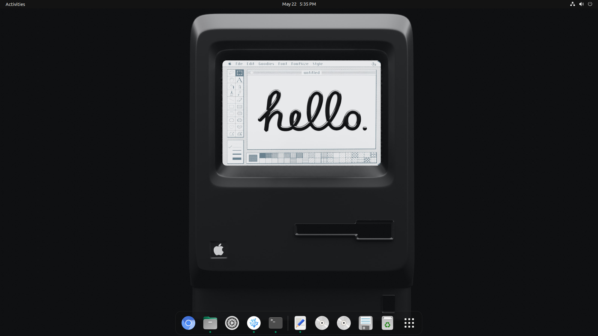
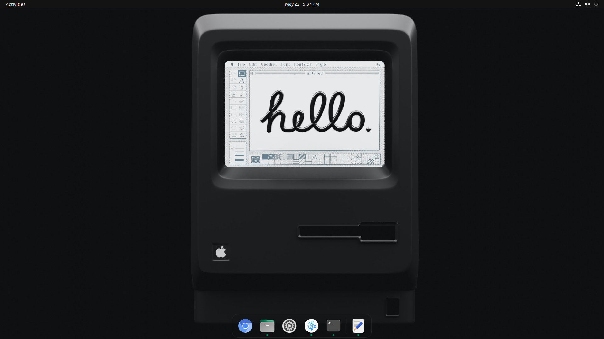

# Dash-to-Dock
𝘛𝘶𝘵𝘰𝘳𝘪𝘢𝘭 𝘧𝘰𝘳 𝘤𝘶𝘴𝘵𝘰𝘮𝘪𝘴𝘪𝘯𝘨 𝘶𝘣𝘶𝘯𝘵𝘶 𝘥𝘰𝘤𝘬 𝘸𝘪𝘵𝘩𝘰𝘶𝘵 𝘢𝘯𝘺 𝘢𝘱𝘱❤️

# Dock setup 💡

### This is a simple method to customise ubuntu dock.No need to install any applications.Just copy paste the commands to cutomise the dock. 
<br>

### Open the terminal and copy&paste these code.
<br>

# Dash-to-dock 📌

## Code

```
gsettings set org.gnome.shell.extensions.dash-to-dock extend-height false
gsettings set org.gnome.shell.extensions.dash-to-dock dock-position BOTTOM
gsettings set org.gnome.shell.extensions.dash-to-dock transparency-mode FIXED 
```
## Result



<br> 

# Hide the following icons 👁

- Trash icon
- Disk mounts
- Show applications

## Code

~~~
gsettings set org.gnome.shell.extensions.dash-to-dock show-mounts false
gsettings set org.gnome.shell.extensions.dash-to-dock show-trash false
gsettings set org.gnome.shell.extensions.dash-to-dock show-show-apps-button false
~~~
## Result



<br> 

# More customisations 🔧

The following are commands for much more styling.

<br>

# Dock height 📏

## Code

```
gsettings set org.gnome.shell.extensions.dash-to-dock extend-height true
gsettings set org.gnome.shell.extensions.dash-to-dock extend-height false
```


<br> 

# Dock positions 📐
The last word of the command specifies the position
## Code


```
gsettings set org.gnome.shell.extensions.dash-to-dock dock-position TOP
gsettings set org.gnome.shell.extensions.dash-to-dock dock-position LEFT
gsettings set org.gnome.shell.extensions.dash-to-dock dock-position RIGHT
gsettings set org.gnome.shell.extensions.dash-to-dock dock-position BOTTOM
```


<br> 

# Dock-transparency 🔎

The numbers mentioned at the end of the command stands for the opacity
## Code

```
gsettings set org.gnome.shell.extensions.dash-to-dock background-opacity 0.3
```


<br> 

# Restore Dock to default ⌛
## Code

```
gsettings set org.gnome.shell.extensions.dash-to-dock extend-height true
gsettings set org.gnome.shell.extensions.dash-to-dock dock-position LEFT
```


# Restore Icons 👁

## Code

```
gsettings set org.gnome.shell.extensions.dash-to-dock show-mounts true
gsettings set org.gnome.shell.extensions.dash-to-dock show-trash true
gsettings set org.gnome.shell.extensions.dash-to-dock show-show-apps-button true
```

<br>

# Support ✨

## If you like this repo you can give a star ⭐ to support me and Also you can [Donate here 🎁](gcard.md) 
© 2022 GitHub, Inc.
